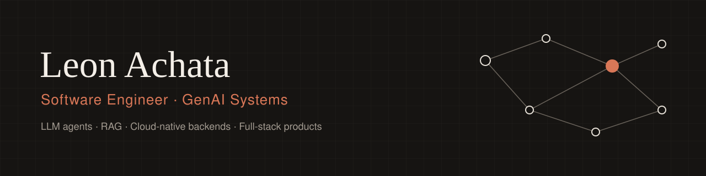

<p align="center">
  
</p>

<p align="center">
  <a href="https://www.linkedin.com/in/leonachata"></a>
  <a href="mailto:leonyemin@gmail.com"></a>
  
  
</p>

## About me

I'm a **Software Engineer** who designs and ships production systems end to end — from typed Python and TypeScript backends to cloud infrastructure and the web front ends that sit on top. My specialty is **Generative AI**: LLM agents, RAG pipelines and workflow automation built to enterprise standards of reliability, security and scale.

Currently I'm a **GenAI Engineer at TCS, working on enterprise projects for Apple**, where I lead the design and delivery of LLM-powered automation that connects internal tools into end-to-end workflows, alongside engineering teams across the Americas and APAC.

```python
leon = {
    "role":      "Software Engineer · GenAI Systems",
    "now":       "GenAI Engineer @ TCS — enterprise projects for Apple",
    "builds":    ["LLM agents", "RAG pipelines", "APIs & backends", "full-stack web apps"],
    "ships_on":  ["AWS", "Docker", "Kubernetes (EKS)"],
    "studying":  "B.Sc. Software Engineering — Universidad Católica del Uruguay",
}
```

## What I work on

- **Agentic systems** — multi-agent orchestration with LangGraph, Google ADK and MCP; native tool calling, planning, self-correction and human-in-the-loop flows.
- **RAG & retrieval** — structure-aware ingestion, hybrid retrieval (dense + BM25 + learned sparse), cross-encoder reranking, cited answers and retrieval evals.
- **Backend engineering** — typed, tested services in Python (FastAPI, Pydantic) and TypeScript (Node.js), REST and GraphQL APIs, SQL and NoSQL data models.
- **Full-stack products** — Next.js / React front ends connected to AI backends, with streaming UIs, from prototype to production.
- **Cloud & DevOps** — containerized deployments on AWS (EKS, Lambda, Bedrock, S3, IoT Core, CloudWatch), infrastructure as code with AWS CDK and Terraform, CI/CD.
- **Data engineering** — PySpark pipelines and data processing for analytics and model workloads.

## Featured projects

<table>
  <tr>
    <td width="50%" valign="top">
      <a href="https://github.com/LeonAchata/SQL-Agent"></a>
      <h3><a href="https://github.com/LeonAchata/SQL-Agent">SQL Agent</a></h3>
      <p>Ask any SQL database questions in plain language. Schema-agnostic catalog via SQLAlchemy, a <b>sqlglot AST guard</b> plus read-only execution, a self-repair loop, PII masking and an <b>execution-accuracy benchmark</b> against gold SQL. Streams every step to a Next.js UI.</p>
      <p><a href="https://github.com/LeonAchata/SQL-Agent/actions/workflows/ci.yml"></a><br/><sub>LangGraph · Claude · FastAPI · Next.js · PostgreSQL / MySQL / SQLite</sub></p>
    </td>
    <td width="50%" valign="top">
      <a href="https://github.com/LeonAchata/DocuChat-AI"></a>
      <h3><a href="https://github.com/LeonAchata/DocuChat-AI">DocuChat</a></h3>
      <p>Grounded answers from your documents. <b>Dense + BM25 + SPLADE</b> hybrid retrieval fused with RRF, cross-encoder reranking, MMR, a <b>corrective-RAG loop that abstains</b> when evidence is weak, and Claude native citations down to the sentence.</p>
      <p><a href="https://github.com/LeonAchata/DocuChat-AI/actions/workflows/ci.yml"></a><br/><sub>LangGraph · Claude · pgvector · ONNX · Next.js</sub></p>
    </td>
  </tr>
  <tr>
    <td width="50%" valign="top">
      <a href="https://github.com/LeonAchata/Toolbox-Gateway"></a>
      <h3><a href="https://github.com/LeonAchata/Toolbox-Gateway">Toolbox Gateway</a></h3>
      <p>Self-hosted platform for tool-using agents: an <b>LLM gateway</b> putting OpenAI, Gemini and Bedrock behind one API with native tool calling, a toolbox served over JSON and <b>native MCP</b>, and a console that traces every call with latency, tokens and cost.</p>
      <p><a href="https://github.com/LeonAchata/Toolbox-Gateway/actions/workflows/ci.yml"></a><br/><sub>LangGraph · MCP · FastAPI · WebSockets · Docker</sub></p>
    </td>
    <td width="50%" valign="top">
      <a href="https://github.com/LeonAchata/InvoiceParser-AI"></a>
      <h3><a href="https://github.com/LeonAchata/InvoiceParser-AI">InvoiceParser AI</a></h3>
      <p>Drop an invoice in <b>17 formats</b> (scanned PDFs, phone photos, UBL XML, e-mails with attachments) and a vision LLM fills the form. Deterministic checks validate totals, tax and RUC check digits, and flag what needs a human look.</p>
      <p><a href="https://github.com/LeonAchata/InvoiceParser-AI/actions/workflows/ci.yml"></a><br/><sub>LangGraph · Vision LLMs · FastAPI · SQLite</sub></p>
    </td>
  </tr>
</table>

### More systems

| Project | What it is | Built with |
| --- | --- | --- |
| [**AWS RAG System**](https://github.com/LeonAchata/AWS-RAG-System) | Serverless RAG on AWS: pgvector + full-text search fused with RRF, Bedrock reranking, Claude cited answers, idempotent event-driven ingestion, alarms, dashboards and X-Ray tracing. | AWS CDK · Lambda · Bedrock · PostgreSQL |
| [**Local RAG Agent**](https://github.com/LeonAchata/Local-RAG-Agent) | Fully offline Q&A over your files: structure-aware legal chunking, hybrid retrieval, incremental re-indexing and a built-in eval (Hit@k, MRR). No API keys, nothing leaves the machine. | Ollama · ChromaDB · Python package |
| [**RoutePlanner AI**](https://github.com/LeonAchata/RoutePlanner-AI) | Paste stops as free text, get the proven-optimal visiting order: Held-Karp DP up to 12 stops, OR-Tools guided local search beyond, on directed real travel-time matrices. | LangGraph · Google Maps · OR-Tools |
| [**CardioSync**](https://github.com/LeonAchata/CardioSync) | ESP32 Holter monitor: 250 Hz FreeRTOS ECG sampling, mutual-TLS MQTT to AWS IoT Core, direct-to-S3 uploads and serverless ECG filtering with R-peak detection. | C++ · AWS IoT · Terraform |

### How I build

Every repository above follows the same bar:

- **Tested without secrets** — test suites mock the LLM and external APIs, so anyone can clone and run them; CI runs on every push.
- **Typed and validated** — Pydantic schemas at every boundary, strict typing where it pays off.
- **Measured, not assumed** — retrieval and agent quality are tracked with benchmarks (execution accuracy, Hit@k, MRR) instead of vibes.
- **Safe by default** — read-only execution, least-privilege roles and credentials, guards on model output, graceful degradation when a dependency fails.
- **Reproducible** — Docker Compose or infrastructure as code (CDK, Terraform), one-command setup and documented architecture.

## Tech stack

**Languages**
<p>
  
</p>

**Backend & web**
<p>
  
</p>

**Data**
<p>
  
</p>

**Cloud & DevOps**
<p>
  
</p>

**AI / ML**


## Experience

| Role | Company | Period |
| --- | --- | --- |
| **GenAI Engineer** — enterprise LLM workflow automation, RAG and agent orchestration | TCS · client: Apple | Mar 2026 – present |
| **AI Engineer** — multi-agent systems (LangGraph, MCP) deployed on AWS EKS/Bedrock | JLR Analytics | Sep 2025 – Feb 2026 |
| **AI/ML Developer** — LLM agents and RAG pipelines for research workloads | Universidad Peruana Cayetano Heredia | Apr 2025 – Sep 2025 |
| **AI/ML Developer · Data Scientist** — NLP models, transformers, data pipelines | Cardiomed SAC | Oct 2023 – Mar 2025 |
| **Data Scientist · Data Analyst** | Asociación Educativa Waymaku | Jan 2020 – Oct 2023 |

## Certifications


-0078D4?style=flat-square&logo=microsoftazure&logoColor=white)


---

<p align="center"><sub>Open to freelance projects and collaborations — reach out on <a href="https://www.linkedin.com/in/leonachata">LinkedIn</a> or by <a href="mailto:leonyemin@gmail.com">email</a>.</sub></p>
